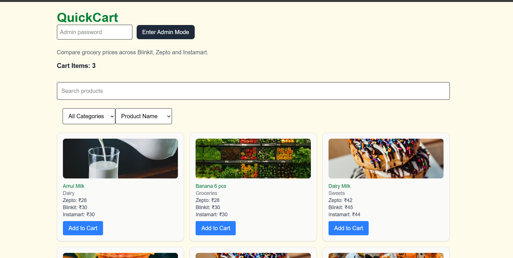
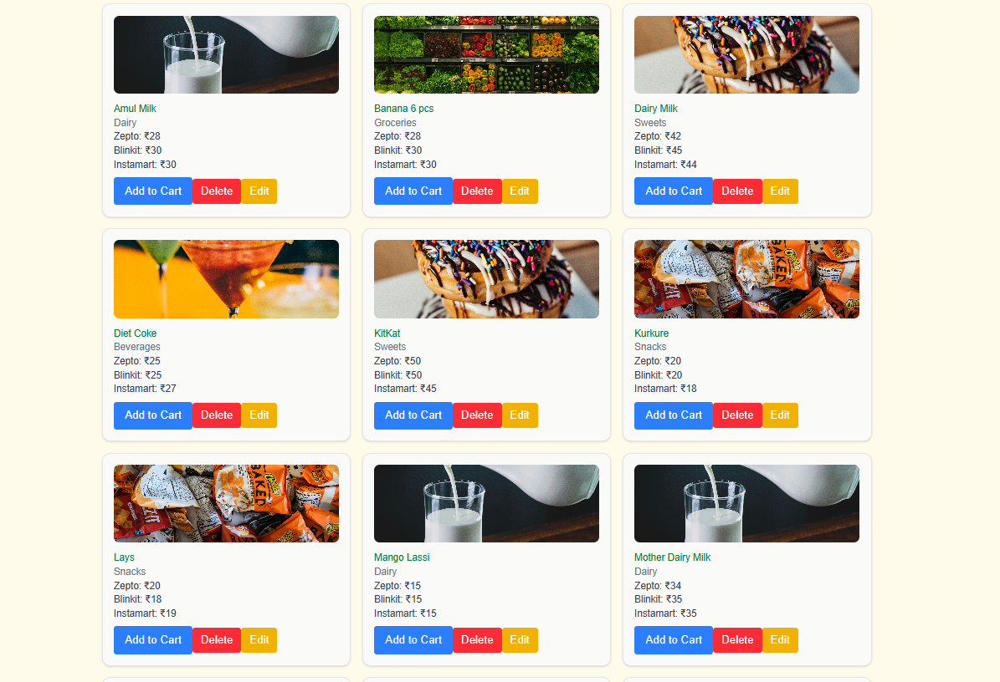
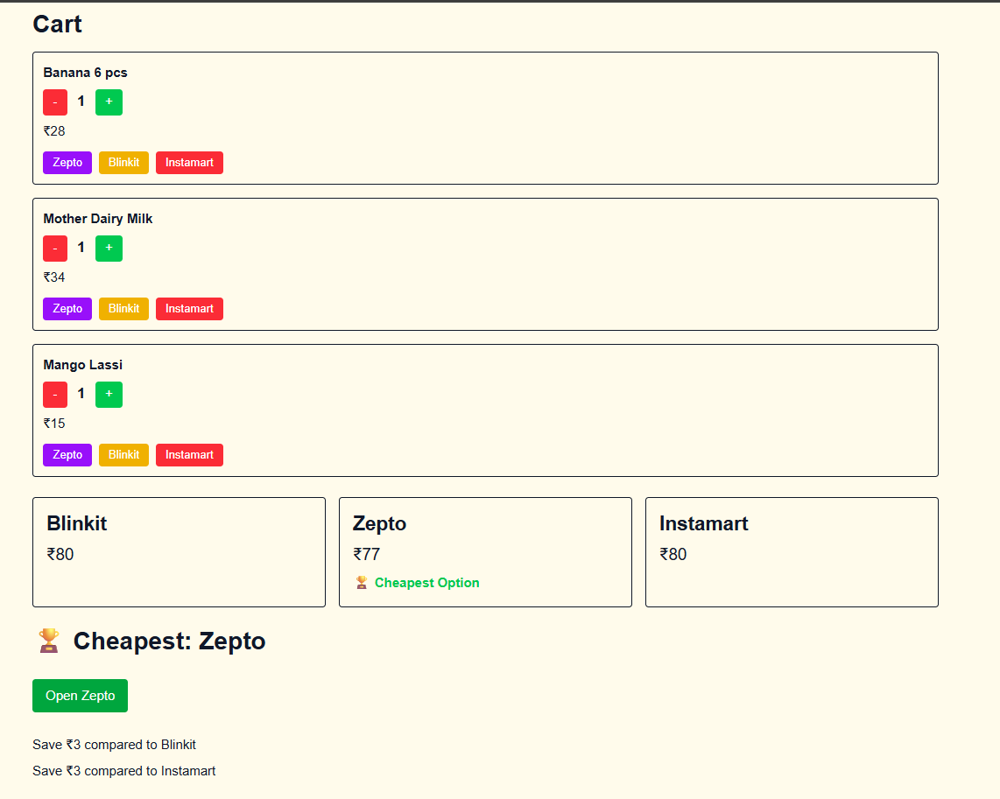
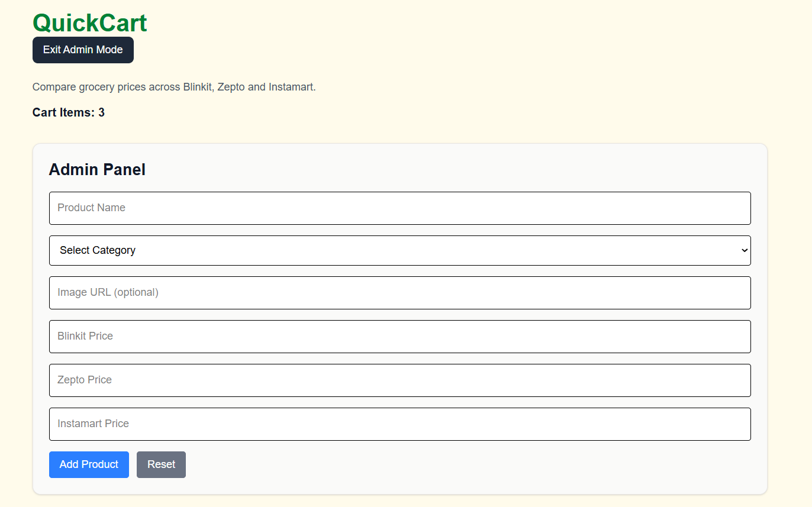

# QuickCart

QuickCart is a full-stack grocery price comparison platform that helps users compare product prices across multiple quick-commerce providers such as Blinkit, Zepto, and Instamart. Users can browse products, compare prices, add items to a cart, and instantly identify the most cost-effective platform for checkout.

## Impact
By eliminating the need to switch between multiple platforms and manually compare prices, QuickCart reduces decision-making time and helps users identify the most cost-effective purchasing option instantly.

---

## Live Demo

Website: https://quickcart-two-kohl.vercel.app/

---

## Features

### Customer Features

* Browse products across multiple categories
* Search products by name
* Filter products by category
* Sort products by price or name
* Add products to cart
* Manage product quantities
* Compare cart totals across Blinkit, Zepto, and Instamart
* Automatically identify the cheapest platform
* View potential savings compared to other platforms
* Direct links to platform search pages
* Persistent cart storage using Local Storage

### Admin Features

* Password-protected Admin Mode
* Add new products
* Edit existing products
* Delete products
* Upload custom product image URLs
* Category-based fallback images

---

## Tech Stack

### Frontend

* Next.js 16
* React
* TypeScript
* Tailwind CSS

### Backend

* Next.js API Routes
* REST APIs

### Database

* MongoDB Atlas

### Deployment

* Vercel

### State Management

* React Hooks (useState, useEffect)

---

## Project Architecture

```bash
src/
├── app/
│   ├── api/
│   │   └── products/
│   │       ├── route.ts
│   │       └── [id]/
│   │           └── route.ts
│   ├── components/
│   │   ├── ProductCard.tsx
│   │   ├── CartItem.tsx
│   │   └── StoreCard.tsx
│   └── page.tsx
│
├── lib/
│   └── mongodb.ts
```

---

## Key Functionalities

### Product Management

Administrators can add, edit, and delete products through a protected admin interface. Product information is stored and managed using MongoDB Atlas.

### Price Comparison Engine

For every product, QuickCart maintains prices from Blinkit, Zepto, and Instamart. The cart automatically calculates platform-wise totals and highlights the cheapest option.

### Shopping Cart

Users can add products, update quantities, and compare total costs across platforms. Cart data is persisted using browser Local Storage.

### Savings Analysis

QuickCart computes potential savings by comparing platform totals and highlights the most cost-effective purchasing option.

---

## Screenshots

### Home Page



### Product Catalog (Admin View)



### Cart Comparison



### Admin Panel



---

## Setup Instructions

### Clone Repository

```bash
git clone https://github.com/Vaibhavi746/quickcart.git
```

### Install Dependencies

```bash
npm install
```

### Configure Environment Variables

Create a `.env.local` file:

```env
MONGODB_URI=<your_mongodb_connection_string>
```

### Run Development Server

```bash
npm run dev
```

Visit:

```text
http://localhost:3000
```

---

## Future Improvements

* User Authentication
* Real-Time Product Data Integration
* Price History Tracking
* Personalized Recommendations
* Product Detail Pages
* Wishlist Functionality
* Custom User Accounts

---

## Author

**Vaibhavi Agarwal**

B.Tech, Computer Science and Engineering
Netaji Subhas University of Technology (NSUT)


